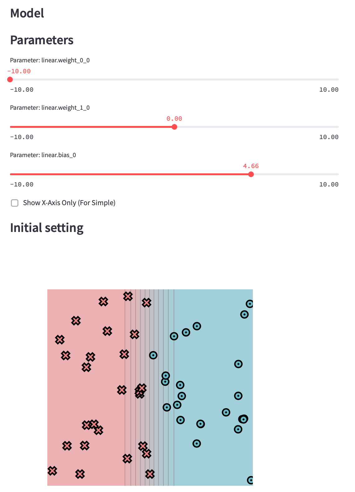
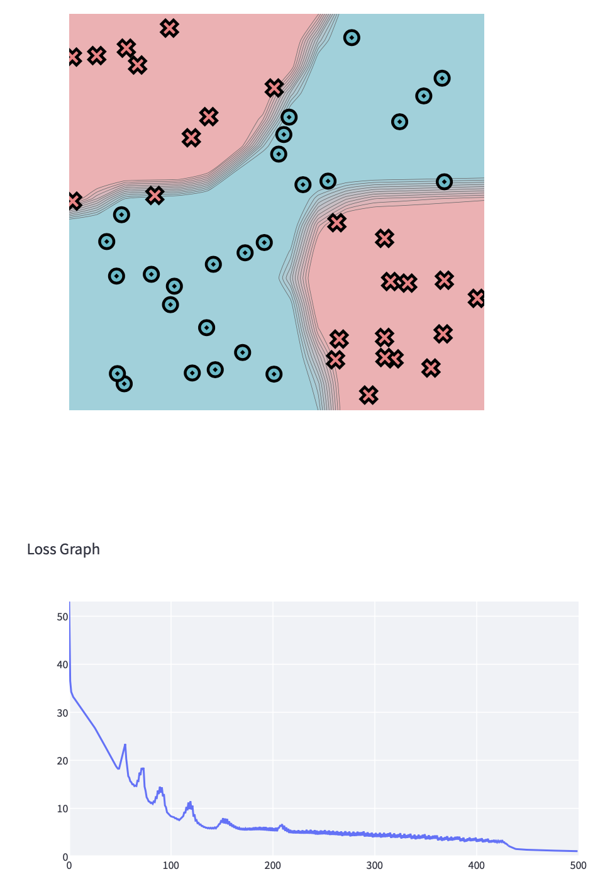
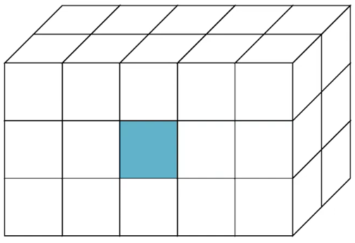
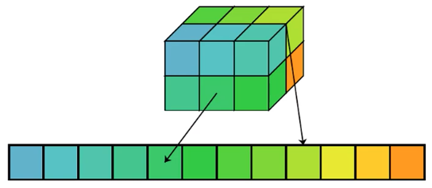

# MiniTorch: A DIY Course on Machine Learning Engineering

This repository is part of my journey to learn the underlying engineering concepts of deep learning systems through implementing a minimal version of PyTorch library.

If you're interested in learning more, I highly recommend checking out the excellent [MiniTorch lectures](https://minitorch.github.io) and [Youtube playlist](https://www.youtube.com/playlist?list=PLO45-80-XKkQyROXXpn4PfjF1J2tH46w8) by [Prof. Rush](https://rush-nlp.com), and the [self-study guide](https://github.com/mukobi/Minitorch-Self-Study-Guide-SAIA/tree/main) by [Gabriel Mukobi](https://gabrielmukobi.com) that answers some common questions.

Topics covered:
- Basic Neural Networks and Modules
- Autodifferentiation for Scalars
- Tensors, Views, and Strides
- Parallel Tensor Operations
- GPU / CUDA Programming in NUMBA
- Convolutions and Pooling
- Advanced NN Functions

## Setup

My virtual environment is based on Python 3.8.
```bash
conda create --name myenv python=3.8
conda activate myenv
```

Install dependencies
```bash
pip install -r  requirements.txt
pip install -r  requirements.extra.txt
pip install -Ue .
conda install llvmlite
pip install altair==4.0
```

Make sure that everything is installed by running python and then checking:
```python
import minitorch
```

Make sure pre-commit enforces style and typing guidelines defined in the config file (.pre-commit-config.yaml)
```bash
pre-commit run --all-files
```

Automatically run pre-commit on git commit
```bash
pre-commit install
```

Tour of Repo:
```
.
|-- minitorch/
|   `-- core of torch libarry
|-- project/
|   `-- code for building ML using minitorch
`-- tests/
    `-- test cases for minitorch
```


To access the autograder:

* Module 0: https://classroom.github.com/a/qDYKZff9
* Module 1: https://classroom.github.com/a/6TiImUiy
* Module 2: https://classroom.github.com/a/0ZHJeTA0
* Module 3: https://classroom.github.com/a/U5CMJec1
* Module 4: https://classroom.github.com/a/04QA6HZK
* Quizzes: https://classroom.github.com/a/bGcGc12k

## Module 0 - Fundamentals

- [x] Operators
- [x] Testing and Debugging
- [x] Functional Python
- [x] Modules
- [x] Visualization

To run visualization for Module 0, use:
``` bash
streamlit run project/app.py -- 0
```

Then you should be able to see interactive data visualizations and you could "turn the knobs" of the parameters to explore model behaviour.


## Module 1 - Autodiff

- [x] Numerical Derivatives
- [x] Scalars
- [x] Chain Rule
- [x] Backpropagation
- [x] Training

PyTorch terminology in computational graph:
- Leaf nodes: variables created from scratch on the left hand side (e.g., `minitorch.Scalar(0.0)` )
- Non-leaf nodes: variables created with a Function
- Constant nodes: terms that passed in that is not a variable (scalars without a history, e.g., `minitorch.Scalar(0.0, None)` )

Backpropagation algorithm:
1. Call topological sort. The result should start from the right of the computational graph (i.e., the output)
2. Create a dict of variables and derivatives
3. For each node in topological sort
   1. If variable is a leaf, then add its final derivative
   2. If the variable is not a leaf
      1. Call backward with its derivative as $d$
      2. Loop through all the variables and derivative
      3. Accumulate derivatives for the variable

To run visualization for Module 1, use:
``` bash
streamlit run project/app.py -- 1
```

Here's the training result for the XOR dataset.


The parameters are
```
PTS = 50
DATASET = minitorch.datasets["Xor"](PTS)
HIDDEN = 10
RATE = 0.5
```

## Module 2 - Tensors

- [x] Tensor Data - Indexing
- [x] Tensor Broadcasting
- [x] Tensor Operations
- [x] Gradients and Autograd
- [x] Training

### Tensors

Dimension
- Number of dimensions
- 1-dimensional tensors: vectors
- 2-dimensional tensors: matrices
- 3-dimensional tensors: cubes

Shape
- Number of cells per dimension
- 1-dimensional tensors: (5,) (row vector of size 5)
- 2-dimensional tensors: (2,3)
- 3-dimensional tensors: (2,3,3)

Size
- The number of scalars a tensor can store
- Tensor of shape (5,2) can store the same amount of data as a tensor of shape (1,5,2)
- Note: `torch.Tensor.shape` is an alias for `torch.Tensor.size()`

Visual Convention
- Indexing convention differes among different systems.
- For this tutorial, 3D tensor indexing follows `[depth, row, columns]`
- For example, `tensor[0,1,2]` would give this blue cube in a cube of shape `(2,3,5)`

  

Storage
- This is where the core data of the tensor is kept.
- It is always a 1-D array of numbers of length `size`, no matter the `dim` or `shape` of the tensor.
- Keeping a 1-D storage allows us to have tensors with different shapes point to the same type of underlying data.

Strides
- A tuple that provides the mapping from user `indexing` (high-dimensional index) to the `position` (1-D index) in the 1-D `storage`.
- Prefer contiguous strides: the right-most stride is 1, bigger strides to the left
- For row vectors, strides are (1,)
- For column vectors, strides are (1,1)
- Strides of (2,1): each row moves 2 steps in storage and each column moves 1 step. A size 10 tensor with strides of (2,1) will give us a matrix of shape (5,2)

  
- Strides of (1,2): each row moves 1 step in storage and each column moves 2 steps. A size 10 tensor with strides of (1,2) will give us a matrix of shape (2,5)

  
- Strides of (6,3,1): each row moves 3 step in storage, each column moves 1 step, and each depth moves 6 steps. A size 12 tensor with strides of (6,3,1) will give us a matrix of shape (2,2,3)

  
- Strides enable 3 operations:
  - Indexing: assuming strides of `(s1, s2, ...)` and we want to look up `tensor[index1, index2, ...]`, its position in storage is `storage[s1*index1 + s2*index2 + ...]`
  - Movement: how to move to the next row/column?
  - Reverse indexing: how to find `index` based on `position`?

View
- Returns a new tensor with the same data as the self tensor but of a different shape.
    ```python
    >>> x = torch.randn(4, 4)
    >>> x.size()
    torch.Size([4, 4])
    >>> y = x.view(16)
    >>> y.size()
    torch.Size([16])
    >>> z = x.view(-1, 8)  # the size -1 is inferred from other dimensions
    >>> z.size()
    torch.Size([2, 8])
    ```

Permute
- Returns a view of the original tensor input with its dimensions permuted.
- Similar to matrix transpose
    ``` python
    >>> x = torch.randn(2, 3, 5)
    >>> x.size()
    torch.Size([2, 3, 5])
    >>> torch.permute(x, (2, 0, 1)).size()
    torch.Size([5, 2, 3])
    ```

### Tensor Core Operations

Map
- Apply to all elements, e.g., `t1.log()`, `t1.exp()`, `-t1`
  ```python
  map(fn: Callable[[float], float]) -> Callable[[Tensor], Tensor]
  ```

Zip
- Apply to all pairs of same shape, e.g., `t1 + t2`, `t1 * t2` (not mat mul), `t1 < t2`
  ```python
  zip(fn: Callable[[float, float], float]) -> Callable[[Tensor, Tensor], Tensor]
  ```

Reduce
- Reduce the full tensor or reduce 1 dimension, e.g., `t1.sum()`, `t1.mean(1)`
  ```python
  reduce(fn: Callable[[float, float], float], start: float = 0.0) -> Callable[[Tensor, int], Tensor]
  ```
- If no argument is given, then it returns a tensor of shape 1.
- If 1 argument is given, then it reduces the given dimension.
- In MiniTorch, we keep the dimension that we reduced. However, in Torch and Numpy, the default behaviour is to remove the dimension entirely.
  ```python
  >>> t = minitorch.rand((3,4,5)).mean(1)
  >>> t.shape
  (3,1,5)
  >>> t = torch.mean(torch.rand(3,4,5), 1)
  >>> t.shape
  torch.Size([3, 5])
  >>> t = torch.mean(torch.rand(3,4,5), 1, keepdim=True)
  >>> t.shape
  torch.Size([3, 1, 5])
  ```

Broadcasting
- Augmenting map & zip to make tensors with different shapes work together
- This avoids using for-loops and intermediate terms by making it easier to apply certain operations many times
- Rules to determine the output shape:
  - Dimensions of size 1 broadcast with anything.
    - E.g., `t1.view(4,3) + t2.view(1,3)` gives output shape of (4,3)
    - E.g., `t1.view(4,3,1) + t2.view(4,1,5)` gives output shape of (4,3,5)
  - Zip automatically adds dim of size 1 to the left
    - E.g., `t1.view(4,3) + tensor([1,2,3])` gives output shape of (4,3)
    - E.g., `t1.view(4,3,1) + t2.view(1,5)` gives output shape of (4,3,5)
  - Extra dimensions of size 1 can be added with `view` operation
    - Note: `t1.view(4,3) + tensor([1,2,3,4])` would fail because tensor of shape (4,3) cannot be added with tensor of shape (1,4). `t1.view(4,3,1) + t2.view(4,5)` would also fail
    - E.g., `t1.view(4,3) + tensor([1,2,3,4]).view(4,1)` gives output shape of (4,3)
- Broadcasting is only about shapes. It does not take strides into account in any way. It is purely a high-level protocol.

Special PyTorch Syntax (not available in MiniTorch)
- Using the `none` keyword to create the extra dimension of 1
    ```python
    >>> x = torch.tensor([1,2,3])
    >>> x.shape
    torch.Size([3])
    >>> x[None].shape
    torch.Size([1, 3])
    >>> x[:, None].shape
    torch.Size([3, 1])
    ```
- `torch.arange`
  - Returns a 1-D tensor with values from the interval `[start, end)` taken with common difference `step` beginning from `start`.
    ```python
    >>> torch.arange(1, 2.5, 0.5)
    tensor([ 1.0000,  1.5000,  2.0000])
    ```
- `torch.where`
  - This function acts as a if-else statement and applies to every dimension of a tensor simultaneously
    ```python
    >>> x = torch.where(
        torch.tensor([True, False]),
        torch.tensor([1, 1]),
        torch.tensor([0, 0]),
    )
    >>> x
    tensor([1,0])
    ```

### Tensor Gradients

Terminology
- Scalar --> Derivative
- Tensor --> Gradient (storing many derivatives)

Derivatives
- Function with a tensor input is like multiple args
- Function with a tensor output is like multiple functions
- Backward: chain rule from each output to each input
- Rule to determine the output shape of derivatives:
  - The derivative of a function $f: \mathbb{R}^n \rightarrow \mathbb{R}^m$ is $df: \mathbb{R}^n \rightarrow \mathbb{R}^{m\times n}$
- Tensor-to-scalar example:
  - $G([x_1, x_2, x_3]) = x_1 \cdot x_2 \cdot x_3$ is a a tensor-to-scalar function, and $f(z)$ is a scalar-to-scalar function
  - $G'([x_1, x_2, x_3]) = [x_2 \cdot x_3, x_1 \cdot x_3, x_1 \cdot x_2]$ is a tensor-to-tensor function, and $f'(z) = d$
  - Applying chain rule, $f'(G([x_1, x_2, x_3])) = [x_2x_3d, x_1x_3d, x_1x_2d]$
- Tensor-to-tensor example:
  - $G([x_1, x_2]) = [G^1(\textbf{x}), G^2(\textbf{x})] = [z_1, z_2] = \textbf{z}$ is a tensor-to-tensor function, where $G^1(\textbf{x}) = x_1$ and $G^2(\textbf{x}) = x_1x_2$. $f(\textbf{z})$ is a tensor-to-scalar function
  - $G'^1_{x_1} = 1$, $G'^1_{x_2} = 0$, $G'^2_{x_1} = x_2$, $G'^2_{x_2} = x_1$, $f'(z_1) = d_1$, $f'(z_2) = d_2$
  - Applying chain rule, $f'_{x_1}(G(\textbf{x})) = d_1 \times 1 + d_2 \times x_2$ and $f'_{x_1}(G(\textbf{x})) = d_1 \times 0 + d_2 \times x_1$
  - More generally, $f'_{x_j}(G(\textbf{x})) = \sum_i d_i G'^{i}_{x_j}(\textbf{x})$
  - There's a $d$ value for each of the output arguments

Backward for Map operations:
- $G'^i_{x_j}(\textbf{x}) = 0$ if $i \neq j$
- $f'_{x_j}(G(\textbf{x})) = d_j G'^j_{x_j}(\textbf{x})$
- In backward, we only need to compute the derivative for each scalar position and then apply a `mul` map, i.e. `mul_map(g'(x), d_out)`

  

Backward for Zip operations:
- $G'^i_{x_j}(\textbf{x}, \textbf{y}) = 0$ if $i \neq j$
- $f'_{x_j}(G(\textbf{x}, \textbf{y})) = d_j G'^j_{x_j}(\textbf{x}, \textbf{y})$, $f'_{y_j}(G(\textbf{x}, \textbf{y})) = d_j G'^j_{y_j}(\textbf{x}, \textbf{y})$
- In backward, we only need to compute the derivative for each scalar position and then apply a `mul` map, i.e. `mul_map(g'(x, y), d_out)`

  

Backward for Reduce operations:
- $G'^i_{x_j}(\textbf{x}; dim) = 0$ if $i \neq j$
- $f'_{x_j}(G(\textbf{x}; dim)) = d_j G'^j_{x_j}(\textbf{x}; dim)$
- In backward, we only need to compute the derivative for each scalar position and then apply a `mul` map, i.e. `mul_map(g'(x, y), d_out)`. Here `d_out` is broadcasted to match the shape of `g'(x, y)`

  

## Module 3 - Efficiency

- [ ] Parallelization
- [ ] Matrix Multiplication
- [ ] CUDA Operations
- [ ] CUDA Matrix
- [ ] Training

## Module 4 - Networks

- [ ] 1D Convolution
- [ ] 2D Convolution
- [ ] Pooling
- [ ] Softmax and Dropout
- [ ] Extra Credit
- [ ] Training an Image Classifier
